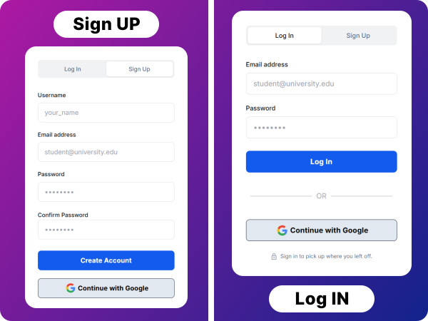
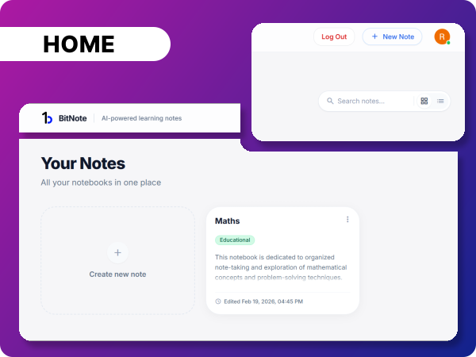
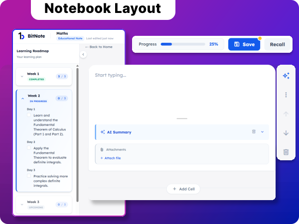
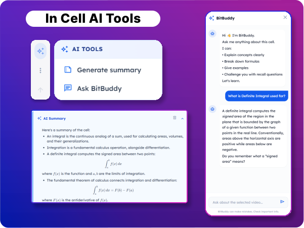

#  BitNote — AI-Powered Note-taking Application

**BitNote** is an AI-powered note-taking application built for **structured learning**. It combines Notion-style flexibility with AI-guided education — generating syllabuses, learning roadmaps, recall quizzes, and smart summaries — all powered by **local LLMs** via [Ollama](https://ollama.com).


-orange)


---

## ✨ Features

### 📝 Notebooks
- Create **general-purpose** or **educational** notebooks
- Rich cell-based editor with reorder, and week-based organization
- File attachments (images, PDFs) per cell
- AI-powered cell summarization

### 🎓 Educational AI
- **AI-generated syllabus** — structured topic breakdown
- **Learning roadmap** — week-by-week plan with daily actionable tasks
- **Recall quizzes** — MCQ, True/False, and short-answer questions generated from your notes
- **Smart evaluation** — AI grades your answers with nuanced feedback (correct / partial / incorrect)
- **Mastery tracking** — session-based scoring and progress stats

### 🔐 Authentication
- Email + password signup/login (with Argon2 hashing)
- **Google Sign-In** via Firebase Authentication
- Session-based user management

### 📬 Contact
- Built-in contact form with email delivery via SMTP (Gmail)

---

## 📸 Screenshots

### 🔐 Authentication — Sign Up & Log In

> Seamlessly create an account or log in using your email and password, or skip the form entirely with **Google Sign-In**. The auth page features a clean card layout with tab-based switching between Sign Up and Log In modes.

<p align="center">
  
</p>

---

### 🏠 Home — Your Notes Dashboard

> All your notebooks live in one place. The home dashboard gives you a bird's-eye view of every notebook you've created, with quick access to search, create a new note, and jump straight back in where you left off.

<p align="center">
  
</p>

---

### 📓 Notebook Layout — Learning Roadmap & Cell Editor

> Educational notebooks come with an AI-generated **Learning Roadmap** — a week-by-week, day-by-day plan broken into actionable tasks. The right panel hosts the cell-based editor where you write notes, attach files, and generate AI summaries. Progress is tracked live at the top.

<p align="center">
  
</p>

---

### 🤖 In-Cell AI Tools — AI Summary & BitBuddy Chat

> Every cell in your notebook comes with built-in AI superpowers. Tap **Generate Summary** to get an instant AI-written breakdown of your notes, or open **BitBuddy** — an AI assistant that can explain concepts, break down formulas, give examples, and challenge you with recall questions — all in context of that specific cell.

<p align="center">
  
</p>

---

## 🏗️ Tech Stack

| Layer | Technology |
|-------|-----------|
| **Backend** | Python, FastAPI |
| **Frontend** | HTML, CSS (TailwindCSS), JavaScript |
| **AI / LLM** | Ollama (`gemma3`, local, default) — or Gemini (`gemini-3.5-flash-lite`, hosted), switchable via `.env` |
| **Database** | SQLite |
| **Auth** | Firebase Admin SDK (Google Sign-In) |
| **Password Hashing** | Argon2 (via passlib) |
| **Email** | aiosmtplib (Gmail SMTP) |

---

## 📂 Project Structure

```
BitNote/
├── bitnote-backend/
│   ├── bitnote/
│   │   ├── main.py                          # FastAPI app entry point
│   │   ├── contact.py                       # Contact form email handler
│   │   ├── api/
│   │   │   ├── auth.py                      # Signup, Login, Google Auth
│   │   │   └── v1/
│   │   │       ├── router.py                # Main API router
│   │   │       ├── notebooks.py             # Notebook & Cell CRUD
│   │   │       ├── recall.py                # Recall quiz system
│   │   │       └── educational_ai/          # AI learning endpoints
│   │   │           ├── learning_plan.py
│   │   │           ├── cell_chat.py
│   │   │           ├── syllabus.py
│   │   │           ├── roadmap.py
│   │   │           └── checklist.py
│   │   ├── core/
│   │   │   ├── config.py                    # App constants
│   │   │   ├── database.py                  # SQLite connection
│   │   │   ├── security.py                  # Password hashing, JWT auth
│   │   │   ├── rate_limit.py                 # Login/signup rate limiting
│   │   │   └── llm_client.py                # LLM wrapper (Ollama or Gemini, via env var)
│   │   ├── schemas/                         # Pydantic request/response models
│   │   ├── services/educational_ai/         # AI service logic
│   │   └── utils/                           # Helpers (JSON extraction)
│   ├── firebase_key.json                    # 🔑 Firebase credentials (DO NOT COMMIT)
│   ├── requirements.txt
│   └── README.md
│
├── bitnote-frontend/
│   └── src/
│       ├── index.html                       # Landing page
│       ├── auth.html                        # Login / Signup page
│       ├── home.html                        # Dashboard
│       ├── create-note.html                 # New notebook creation
│       ├── notebook.html                    # Notebook editor
│       ├── explore.html                     # Explore notebooks
│       ├── demo.html                        # Demo page
│       ├── contact.html                     # Contact form
│       ├── scripts/                         # JavaScript modules
│       └── styles/                          # CSS stylesheets
│
├── .gitignore
└── README.md                                # ← You are here
```

---

## 🚀 Getting Started

### Prerequisites

Make sure you have the following installed:

- **Python 3.12+** — [Download](https://www.python.org/downloads/)
- **Ollama** — [Download](https://ollama.com/download)
- **Git** — [Download](https://git-scm.com/downloads)
- A **Google account** (for Firebase setup)
- A code editor (VS Code, PyCharm, etc.)

---

### 1️⃣ Clone the Repository

```bash
git clone https://github.com/Rahul-134/bitnote.git
cd BitNote
```

---

### 2️⃣ Set Up the Backend

#### Install Python Dependencies

```bash
cd bitnote-backend
pip install -r requirements.txt
```

---

### 3️⃣ Set Up Ollama (Local AI)

BitNote uses [Ollama](https://ollama.com) to run the **gemma3** LLM locally — no API keys or cloud costs needed.

#### Install Ollama

Download and install from [ollama.com/download](https://ollama.com/download).

#### Pull the gemma3 model

```bash
ollama pull gemma3
```

#### Verify it works

```bash
ollama run gemma3 "Hello, are you working?"
```

> The first pull may take a few minutes depending on your internet speed. The `gemma3` model is approximately 5GB.

---

### 🔁 Alternative: Use a Hosted LLM (Gemini) Instead of Ollama

If you'd rather not run a local model — for example, when deploying to a server without
enough RAM/GPU for Ollama — BitNote can call Google's Gemini API instead. Nothing about
the app's behavior changes either way; it's a single environment variable.

1. Copy `bitnote-backend/.env.example` to `bitnote-backend/.env`.
2. Get a free API key at [aistudio.google.com/apikey](https://aistudio.google.com/apikey).
3. Set the following in your `.env`:

```bash
LLM_PROVIDER=gemini
GEMINI_API_KEY=your-key-here
GEMINI_MODEL=gemini-3.5-flash-lite
```

That's it — no code changes needed. Leave `LLM_PROVIDER` unset (or set to `ollama`) to
keep using local Ollama as before; `OLLAMA_MODEL` (default `gemma3`) works the same way
if you want to swap to a different local model.

---

### 4️⃣ Set Up Firebase (Google Sign-In)

Firebase is used **only** for Google Sign-In authentication. Follow these steps carefully:

#### A. Create a Firebase Project

1. Go to [Firebase Console](https://console.firebase.google.com/)
2. Click **"Create a project"** (or "Add project")
3. Enter a project name (e.g., `BitNote`)
4. Disable Google Analytics (optional) → Click **"Create Project"**

#### B. Enable Google Sign-In

1. In your Firebase project, go to **Authentication** (left sidebar)
2. Click **"Get Started"**
3. Go to the **"Sign-in method"** tab
4. Click **"Google"** → Toggle **Enable** → Select a support email → Click **"Save"**

#### C. Register a Web App

1. Go to **Project Settings** (gear icon ⚙️ → "Project settings")
2. Scroll down to **"Your apps"**
3. Click the **Web** icon (`</>`) to add a web app
4. Enter a nickname (e.g., `BitNote Web`) → Click **"Register app"**
5. You'll see a `firebaseConfig` object like this:

```javascript
const firebaseConfig = {
    apiKey: "AIzaSy...",
    authDomain: "your-project.firebaseapp.com",
    projectId: "your-project-id",
    appId: "1:123456:web:abcdef"
};
```

6. **Copy these values** and update them in `bitnote-frontend/src/auth.html` (lines 77–82):

```javascript
const firebaseConfig = {
    apiKey: "YOUR_API_KEY",
    authDomain: "YOUR_PROJECT.firebaseapp.com",
    projectId: "YOUR_PROJECT_ID",
    appId: "YOUR_APP_ID",
};
```

#### D. Generate a Firebase Service Account Key (Backend)

1. In Firebase Console → **Project Settings** → **Service Accounts** tab
2. Click **"Generate new private key"** → Confirm
3. A JSON file will be downloaded — **this is your `firebase_key.json`**
4. **Move this file** to `bitnote-backend/firebase_key.json`

```
bitnote-backend/
├── firebase_key.json   ← place it here
├── bitnote/
├── requirements.txt
└── ...
```

> ⚠️ **IMPORTANT:** This file contains your private key. **NEVER** commit it to GitHub. It is already listed in `.gitignore`.

#### E. Firebase Key Path

`bitnote-backend/bitnote/api/auth.py` automatically looks for `firebase_key.json` next to the `bitnote-backend` folder (i.e. where you placed it in step D) — no path editing needed.

If you'd rather keep the key somewhere else, point the app at it with an environment variable instead of editing the source:

```bash
export FIREBASE_KEY_PATH=/path/to/your/firebase_key.json
```

---

### 5️⃣ Set Up the Database (SQLite)

BitNote uses **SQLite** — no separate database server needed. You just need to create the database file and tables.

#### A. Create the Database Directory

```bash
mkdir -p bitnote-backend/bitnote/database
```

#### B. Create the Database and Tables

Run the following command from the project root to create all required tables:

```bash
cd bitnote-backend
python -c "
import sqlite3

conn = sqlite3.connect('bitnote/database/bitnote.db')
cursor = conn.cursor()

# Users table
cursor.execute('''
CREATE TABLE IF NOT EXISTS users (
    user_id INTEGER PRIMARY KEY AUTOINCREMENT,
    username TEXT NOT NULL,
    email TEXT UNIQUE NOT NULL,
    password_hash TEXT,
    created_at INTEGER DEFAULT (strftime('%s', 'now'))
)
''')

# Notebooks table
cursor.execute('''
CREATE TABLE IF NOT EXISTS notebooks (
    notebook_id TEXT PRIMARY KEY,
    user_id INTEGER NOT NULL,
    title TEXT NOT NULL,
    notebook_type TEXT DEFAULT 'general',
    description TEXT,
    created_at INTEGER,
    updated_at INTEGER,
    FOREIGN KEY (user_id) REFERENCES users(user_id) ON DELETE CASCADE
)
''')

# Cells table
cursor.execute('''
CREATE TABLE IF NOT EXISTS cells (
    cell_id TEXT PRIMARY KEY,
    notebook_id TEXT NOT NULL,
    order_index INTEGER DEFAULT 0,
    week INTEGER DEFAULT 1,
    user_content TEXT,
    ai_content TEXT,
    FOREIGN KEY (notebook_id) REFERENCES notebooks(notebook_id) ON DELETE CASCADE
)
''')

# Educational metadata table
cursor.execute('''
CREATE TABLE IF NOT EXISTS educational_metadata (
    edu_id INTEGER PRIMARY KEY AUTOINCREMENT,
    notebook_id TEXT NOT NULL,
    learning_goal TEXT,
    course_topic TEXT,
    syllabus TEXT,
    roadmap TEXT,
    progress REAL DEFAULT 0.0,
    created_at TEXT,
    FOREIGN KEY (notebook_id) REFERENCES notebooks(notebook_id) ON DELETE CASCADE
)
''')

# Tasks table (learning roadmap tasks)
cursor.execute('''
CREATE TABLE IF NOT EXISTS tasks (
    task_id TEXT PRIMARY KEY,
    notebook_id TEXT NOT NULL,
    week INTEGER NOT NULL,
    day INTEGER NOT NULL,
    order_index INTEGER DEFAULT 0,
    task_description TEXT,
    status TEXT DEFAULT 'pending',
    created_at INTEGER,
    updated_at INTEGER,
    FOREIGN KEY (notebook_id) REFERENCES notebooks(notebook_id) ON DELETE CASCADE
)
''')

# Cell attachments table
cursor.execute('''
CREATE TABLE IF NOT EXISTS cell_attachments (
    attachment_id TEXT PRIMARY KEY,
    cell_id TEXT NOT NULL,
    file_name TEXT NOT NULL,
    file_type TEXT,
    storage_path TEXT,
    created_at INTEGER,
    FOREIGN KEY (cell_id) REFERENCES cells(cell_id) ON DELETE CASCADE
)
''')

# Recall sessions table
cursor.execute('''
CREATE TABLE IF NOT EXISTS recall_sessions (
    session_id TEXT PRIMARY KEY,
    edu_id INTEGER NOT NULL,
    difficulty TEXT,
    question_count INTEGER,
    average_score REAL,
    created_at TEXT DEFAULT (datetime('now')),
    FOREIGN KEY (edu_id) REFERENCES educational_metadata(edu_id) ON DELETE CASCADE
)
''')

# Recall questions table
cursor.execute('''
CREATE TABLE IF NOT EXISTS recall_questions (
    id INTEGER PRIMARY KEY AUTOINCREMENT,
    edu_id INTEGER NOT NULL,
    question TEXT NOT NULL,
    answer TEXT NOT NULL,
    question_type TEXT,
    options TEXT,
    difficulty TEXT,
    session_id TEXT,
    FOREIGN KEY (edu_id) REFERENCES educational_metadata(edu_id) ON DELETE CASCADE,
    FOREIGN KEY (session_id) REFERENCES recall_sessions(session_id) ON DELETE CASCADE
)
''')

# Recall attempts table
cursor.execute('''
CREATE TABLE IF NOT EXISTS recall_attempts (
    id INTEGER PRIMARY KEY AUTOINCREMENT,
    recall_question_id INTEGER NOT NULL,
    user_answer TEXT,
    score REAL,
    feedback TEXT,
    created_at TEXT DEFAULT (datetime('now')),
    FOREIGN KEY (recall_question_id) REFERENCES recall_questions(id) ON DELETE CASCADE
)
''')

conn.commit()
conn.close()
print('✅ Database created successfully at bitnote/database/bitnote.db')
"
```

#### C. Database Path

`bitnote-backend/bitnote/core/database.py` automatically resolves `DB_PATH` to `bitnote-backend/bitnote/database/bitnote.db` — no editing needed, and the folder is created automatically on first run.

To point it somewhere else instead, set an environment variable rather than editing the source:

```bash
export BITNOTE_DB_PATH=/path/to/your/bitnote.db
```

---

### 6️⃣ Configure Email (Contact Form) — Optional

The contact form uses Gmail SMTP. To set it up:

1. Create or use a Gmail account
2. Enable **2-Factor Authentication** on the Gmail account
3. Go to [Google App Passwords](https://myaccount.google.com/apppasswords)
4. Generate a new app password for "Mail"
5. Update the credentials in `bitnote-backend/bitnote/contact.py`:

```python
EMAIL_USER = "your-email@gmail.com"
EMAIL_PASS = "your-app-password"    # 16-character app password
```

> ⚠️ **Security:** For production, move these to environment variables instead of hardcoding them.

---

### 7️⃣ Run the Application

#### Start Ollama (in a separate terminal)

```bash
ollama serve
```

> If Ollama is already running as a system service, you can skip this step.

#### Start the Backend Server

```bash
cd bitnote-backend
uvicorn bitnote.main:app --reload
```

The backend will be available at:
- **API:** http://127.0.0.1:8000
- **Swagger Docs:** http://127.0.0.1:8000/docs
- **ReDoc:** http://127.0.0.1:8000/redoc

#### Start the Frontend

Open the frontend using a local server. You can use any of these:

**Option A — VS Code Live Server:**
1. Install the "Live Server" extension in VS Code
2. Right-click `bitnote-frontend/src/index.html` → "Open with Live Server"
3. The app will open at `http://localhost:5500`

**Option B — Python HTTP server:**
```bash
cd bitnote-frontend/src
python -m http.server 5500
```

**Option C — Node.js (npx):**
```bash
cd bitnote-frontend/src
npx serve -p 5500
```

> **Important:** The backend CORS is configured to allow requests from `localhost:5500` and `localhost:3000`. If you use a different port, update the `allow_origins` list in `bitnote-backend/bitnote/main.py`.

---

## 🔌 API Endpoints

### Authentication
| Method | Endpoint | Description |
|--------|----------|-------------|
| POST | `/auth/signup` | Register with email & password |
| POST | `/auth/login` | Login with email & password |
| POST | `/auth/google` | Google Sign-In via Firebase |

### Notebooks
| Method | Endpoint | Description |
|--------|----------|-------------|
| GET | `/api/v1/notebooks/` | List all notebooks |
| POST | `/api/v1/notebooks/` | Create a general notebook |
| POST | `/api/v1/notebooks/educational` | Create an AI educational notebook |
| GET | `/api/v1/notebooks/{id}` | Get notebook details |
| PATCH | `/api/v1/notebooks/{id}/rename` | Rename notebook |
| DELETE | `/api/v1/notebooks/{id}` | Delete notebook |

### Cells
| Method | Endpoint | Description |
|--------|----------|-------------|
| GET | `/api/v1/notebooks/{id}/cells` | Get all cells |
| POST | `/api/v1/notebooks/{id}/cells` | Add a new cell |
| PUT | `/api/v1/notebooks/{id}/cells/{cellId}` | Update cell content |
| DELETE | `/api/v1/notebooks/{id}/cells/{cellId}` | Delete a cell |
| POST | `/api/v1/notebooks/{id}/cells/{cellId}/summarize` | AI summarize cell |
| POST | `/api/v1/notebooks/{id}/cells/{cellId}/move` | Move cell up/down |
| POST | `/api/v1/notebooks/{id}/cells/{cellId}/move-week` | Move cell to another week |

### Recall / Quiz System
| Method | Endpoint | Description |
|--------|----------|-------------|
| POST | `/api/v1/recall/generate/{notebookId}` | Generate recall questions |
| GET | `/api/v1/recall/questions/{notebookId}` | Get latest questions |
| POST | `/api/v1/recall/session/evaluate/{sessionId}` | Evaluate all answers |
| GET | `/api/v1/recall/stats/{notebookId}` | Get mastery score |
| GET | `/api/v1/recall/sessions/{notebookId}` | Get all past sessions |

### Educational AI
| Method | Endpoint | Description |
|--------|----------|-------------|
| POST | `/api/v1/educational-ai/learning-plan` | Generate learning plan |
| POST | `/api/v1/educational-ai/cell-chat` | Chat with AI about a cell |

### Contact
| Method | Endpoint | Description |
|--------|----------|-------------|
| POST | `/api/v1/contact/` | Send contact form email |

---

## 🗄️ Database Schema

BitNote uses **SQLite** with the following tables:

```
┌─────────────────┐     ┌──────────────────────┐
│     users       │     │     notebooks        │
├─────────────────┤     ├──────────────────────┤
│ user_id (PK)    │◄────│ user_id (FK)         │
│ username        │     │ notebook_id (PK)     │
│ email           │     │ title                │
│ password_hash   │     │ notebook_type        │
│ created_at      │     │ description          │
└─────────────────┘     │ created_at           │
                        └──────────┬───────────┘
                                   │
              ┌────────────────────┼──────────────────┐
              ▼                    ▼                   ▼
┌──────────────────┐  ┌────────────────────┐  ┌──────────────┐
│      cells       │  │educational_metadata│  │    tasks     │
├──────────────────┤  ├────────────────────┤  ├──────────────┤
│ cell_id (PK)     │  │ edu_id (PK)        │  │ task_id (PK) │
│ notebook_id (FK) │  │ notebook_id (FK)   │  │ notebook_id  │
│ order_index      │  │ learning_goal      │  │ week         │
│ week             │  │ course_topic       │  │ day          │
│ user_content     │  │ syllabus (JSON)    │  │ task_desc    │
│ ai_content       │  │ roadmap (JSON)     │  │ status       │
└───────┬──────────┘  │ progress           │  └──────────────┘
        │             └────────┬───────────┘
        ▼                      ▼
┌──────────────────┐  ┌────────────────────┐
│ cell_attachments │  │  recall_sessions   │
├──────────────────┤  ├────────────────────┤
│ attachment_id    │  │ session_id (PK)    │
│ cell_id (FK)     │  │ edu_id (FK)        │
│ file_name        │  │ difficulty         │
│ file_type        │  │ question_count     │
│ storage_path     │  │ average_score      │
└──────────────────┘  └────────┬───────────┘
                               ▼
                      ┌────────────────────┐
                      │  recall_questions  │
                      ├────────────────────┤
                      │ id (PK)            │
                      │ edu_id (FK)        │
                      │ question           │
                      │ answer             │
                      │ question_type      │
                      │ options (JSON)     │
                      │ session_id (FK)    │
                      └────────┬───────────┘
                               ▼
                      ┌────────────────────┐
                      │  recall_attempts   │
                      ├────────────────────┤
                      │ id (PK)            │
                      │ recall_question_id │
                      │ user_answer        │
                      │ score              │
                      │ feedback           │
                      └────────────────────┘
```

---

## ⚠️ Important Notes

1. **Firebase Key:** The `firebase_key.json` file is **secret**. Never push it to GitHub. It's already in `.gitignore`.

2. **Auth tokens:** Login/signup issue a JWT session token, signed with `BITNOTE_SECRET_KEY`. If that env var isn't set, the app falls back to an insecure development key and prints a warning — **set `BITNOTE_SECRET_KEY` to a long random value before deploying anywhere real.**

3. **CORS:** The backend allows requests only from `localhost:5500` and `localhost:3000` by default. Set `BITNOTE_CORS_ORIGINS` (comma-separated) to allow other origins instead of editing `bitnote/main.py`.

4. **Email Credentials:** The contact form has hardcoded email credentials in `contact.py`. For production, move these to environment variables.

5. **Ollama:** By default (`LLM_PROVIDER` unset or `ollama`), the AI features require Ollama to be running locally. Without it, educational notebook creation, recall quizzes, and cell summarization will fail. Set `LLM_PROVIDER=gemini` in `.env` to use a hosted model instead — see [Alternative: Use a Hosted LLM (Gemini)](#-alternative-use-a-hosted-llm-gemini-instead-of-ollama) above.

6. **Login rate limiting:** `/auth/login`, `/auth/signup`, and `/auth/google` are rate-limited (10 requests/minute per IP) to slow down brute-force attempts. The limiter is in-memory, so it resets on restart and doesn't share state across multiple worker processes.

---

## 🛣️ Roadmap

- [x] Add JWT-based session tokens
- [ ] Move remaining secrets (contact form email credentials) to environment variables
- [ ] Migrate from SQLite to PostgreSQL
- [ ] Deploy backend (Railway / Render)
- [ ] Deploy frontend (Vercel / Netlify)
- [ ] Add multiple AI model support
- [ ] Real-time collaborative editing
- [ ] Mobile-responsive design improvements

---

## 👨‍💻 Author

**Rahul Lumbhani**

AI Notebook • Ollama • FastAPI • LLM Systems

---

## 📄 License

This project is licensed under the MIT License. See [LICENSE](LICENSE) for details.
